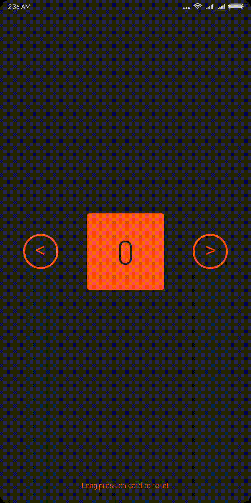

# Counter
Counter application is a simple representation of android animations and interpolators, packed up in a sleek user interface.

## Functions
- Right arrow rotates the card clockwise and counter increases.
- Left arrow rotates the card anti-clockwise and counter decreases.
- Long press on card to wobble it and reset the counter.

## Screencast

## Download
Wanna try it ? grab it now. 

